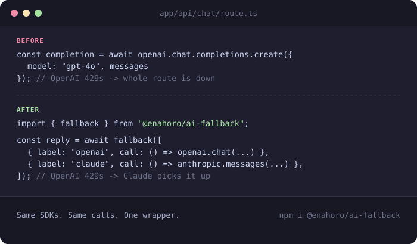

# ai-fallback

<p align="center">
  
</p>

<p align="center">
  <a href="https://www.npmjs.com/package/@enahoro/ai-fallback"></a>
  <a href="https://github.com/enahoro/ai-fallback/actions/workflows/ci.yml"></a>
  <a href="./LICENSE"></a>
</p>

Try multiple LLM providers in order. Falls through on error, rate limit, or timeout — returns the first success.

Requires Node 18+.

```bash
npm install @enahoro/ai-fallback
```

## Usage

```ts
import { fallback } from "@enahoro/ai-fallback";

const res = await fallback([
  () => openai.chat.completions.create({ model: "gpt-4o", messages }),
  () => anthropic.messages.create({ model: "claude-sonnet-4-6", max_tokens: 1000, messages }),
  () => gemini.generateContent(prompt),
]);
```

## With labels, retries, and timeouts

```ts
import { fallback, retryableOnly } from "@enahoro/ai-fallback";

const res = await fallback(
  [
    { label: "openai", call: () => openai.chat.completions.create({ ... }), retries: 1 },
    { label: "claude", call: () => anthropic.messages.create({ ... }) },
    { label: "gemini", call: () => gemini.generateContent(prompt) },
  ],
  {
    timeoutMs: 15_000,          // per-attempt timeout
    retryDelayMs: 500,          // backoff between retries of the SAME provider
    isRetryable: retryableOnly, // don't fall through on 401/403 — those won't fix themselves
    onFallback: (a) => console.warn(`${a.label} failed, falling back:`, a.error),
    onAttempt: (a) => console.log(`[${a.label}] ${a.ok ? "ok" : "fail"} in ${a.durationMs}ms`),
  }
);
```

## Real-world example

A typical Next.js API route calling one provider directly:

```ts
// app/api/chat/route.ts — BEFORE
import OpenAI from "openai";

const openai = new OpenAI({ apiKey: process.env.OPENAI_API_KEY });

export async function POST(req: Request) {
  const { messages } = await req.json();

  try {
    const completion = await openai.chat.completions.create({ model: "gpt-4o", messages });
    return Response.json({ reply: completion.choices[0].message.content });
  } catch (error) {
    // One provider, one failure mode, one dead endpoint.
    return Response.json({ error: "Something went wrong" }, { status: 500 });
  }
}
```

The same route with `fallback()` — the OpenAI and Claude calls themselves are untouched,
only the wrapping changes:

```ts
// app/api/chat/route.ts — AFTER
import OpenAI from "openai";
import Anthropic from "@anthropic-ai/sdk";
import { fallback, retryableOnly, FallbackError } from "@enahoro/ai-fallback";

const openai = new OpenAI({ apiKey: process.env.OPENAI_API_KEY });
const anthropic = new Anthropic({ apiKey: process.env.ANTHROPIC_API_KEY });

export async function POST(req: Request) {
  const { messages } = await req.json();

  try {
    const reply = await fallback(
      [
        {
          label: "openai",
          retries: 1,
          call: async () => {
            const c = await openai.chat.completions.create({ model: "gpt-4o", messages });
            return c.choices[0].message.content;
          },
        },
        {
          label: "claude",
          call: async () => {
            const c = await anthropic.messages.create({
              model: "claude-sonnet-4-6",
              max_tokens: 1000,
              messages,
            });
            return c.content[0].type === "text" ? c.content[0].text : "";
          },
        },
      ],
      {
        timeoutMs: 15_000,
        isRetryable: retryableOnly, // don't waste a fallback hop on a bad API key
        onFallback: (a) => console.warn(`${a.label} failed, falling back:`, a.error),
      }
    );

    return Response.json({ reply });
  } catch (error) {
    if (error instanceof FallbackError) {
      console.error("All providers failed:", error.attempts); // per-provider detail
    }
    return Response.json({ error: "Something went wrong" }, { status: 500 });
  }
}
```

## Why

Every multi-provider AI app ends up hand-rolling this exact try/catch chain. This is the
50-line version, typed, tested, with retry + timeout + observability hooks — nothing else.

- **No SDK lock-in.** Pass any async function. Works with OpenAI, Anthropic, Gemini, or
  literally any promise.
- **Per-provider config.** Different retry counts / timeouts per provider if you need it.
- **Fails loud, not silent.** `FallbackError` carries every attempt's error and timing so you
  can actually debug a full outage instead of just seeing "request failed."
- **Zero dependencies.**

## API

### `fallback(providers, options?)`

- `providers`: array of `() => Promise<T>` or `{ call, label?, retries?, timeoutMs? }`
- `options.timeoutMs` — global per-attempt timeout
- `options.retries` — default retries per provider before moving on (default `0`)
- `options.retryDelayMs` — backoff between retries of the same provider (default `300`)
- `options.isRetryable(error)` — return `false` to stop immediately instead of falling through
  (e.g. don't burn your other providers on a `401`)
- `options.onFallback(attempt)` — fires each time a provider is abandoned
- `options.onAttempt(info)` — fires after every attempt, success or failure (hook your cost/latency logger here)

Throws `FallbackError` (with `.attempts`, one entry per exhausted provider) if everything fails.

### `retryableOnly(error)`

Built-in `isRetryable` helper — treats `401`/`403` as non-retryable, everything else
(429s, 5xxs, timeouts, network errors) as fair game to fall through on.

## Development

```bash
npm install
npm test          # runs the suite in test/index.test.ts (node's built-in test runner + tsx)
npm run build     # compiles src/index.ts -> dist/ (cjs + esm + .d.ts)
npx tsx examples/basic.ts
npx tsx examples/with-options.ts
```

10 tests cover: basic success, single/multi-hop fallback, `FallbackError` shape, per-provider
retries, timeouts, the `isRetryable` short-circuit, the built-in `retryableOnly` classifier,
the `onAttempt`/`onFallback` hooks, and the empty-providers guard.

## Publishing

```bash
npm login
npm publish          # prepublishOnly runs build + test automatically
```

Published as a scoped package (`@enahoro/ai-fallback`) so the name is guaranteed available —
`publishConfig.access` is already set to `"public"` in `package.json`, so a plain `npm publish`
publishes it publicly rather than defaulting to a private (paid) scoped package.

This repo also ships two GitHub Actions workflows:
- `.github/workflows/ci.yml` — runs the test suite on Node 18/20/22 on every push and PR
- `.github/workflows/publish.yml` — publishes to npm automatically when you push a `v*` tag
  (set an `NPM_TOKEN` secret in the repo settings first)

## Contributing

Issues and PRs welcome — [open one here](https://github.com/enahoro/ai-fallback/issues).

## License

MIT
